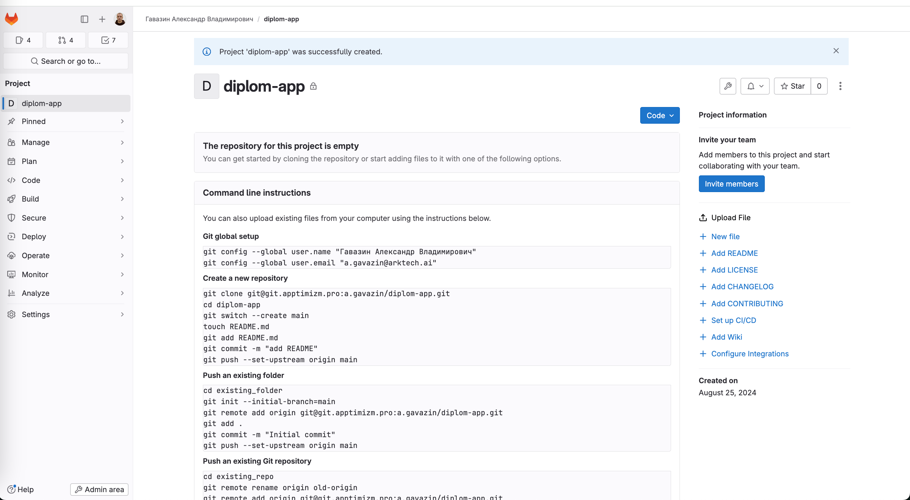

# Дипломный практикум в Yandex.Cloud

## Цели:

1. Подготовить облачную инфраструктуру на базе облачного провайдера Яндекс.Облако.
2. Запустить и сконфигурировать Kubernetes кластер.
3. Установить и настроить систему мониторинга.
4. Настроить и автоматизировать сборку тестового приложения с использованием Docker-контейнеров.
5. Настроить CI для автоматической сборки и тестирования.
6. Настроить CD для автоматического развёртывания приложения.

---

## Этапы выполнения:

### Создание облачной инфраструктуры

Ожидаемые результаты:

1. Terraform сконфигурирован и создание инфраструктуры посредством Terraform возможно без дополнительных ручных действий.
2. Полученная конфигурация инфраструктуры является предварительной, поэтому в ходе дальнейшего выполнения задания возможны изменения.

Решение:

- Создан бакет и настроен backend для файлов состояния:

  

- Создана сеть и подсети d 3-х зонах доступности, публичная для мастера, приватная для рабочих узлов:

  

- Создан региональный Kubernetes кластер в 3-х зонах доступности:

  
  

- Создана группа узлов из 3-х узлов в каждой зоне доступности в приватной сети без внешнего IP-адреса и шлюзом для доступа в интернет:

  

- Общий вид созданной инфраструктуры:

  

Код инфраструктуры в директории [terraform](./terraform/)

---

### Создание Kubernetes кластера

Ожидаемый результат:

1. Работоспособный Kubernetes кластер.
2. В файле `~/.kube/config` находятся данные для доступа к кластеру.
3. Команда `kubectl get pods --all-namespaces` отрабатывает без ошибок.

Решение:

- Добавлена конфигурацию в `~/.kube/config`, у меня конфигураций несколько, так что переключим контекст на созданный класте `yc-diplom-k8s-cluster-o213glj2` и проверяем доступность:

  

---

### Создание тестового приложения

Ожидаемый результат:

1. Git репозиторий с тестовым приложением и Dockerfile.
2. Регистри с собранным docker image. В качестве регистри может быть DockerHub или [Yandex Container Registry](https://cloud.yandex.ru/services/container-registry), созданный также с помощью terraform.

Решение:

- Создан репозиторий приложения:

  
  

- Собран образ с тегом `latest` и отправлен в [Docker Registry](https://hub.docker.com/repository/docker/alexgavaz/diplom-app/):

  

- Собран образ с тегом `1.0.0` и отправлен в [Docker Registry](https://hub.docker.com/repository/docker/alexgavaz/diplom-app/):

  

- Поднятое приложение в кластер с разными тегами и его доступность через LoadBalancer:

  

  

  

  

  

Код приложения в директории [diplom-app](./diplom-app/)

---

### Подготовка cистемы мониторинга и деплой приложения

Ожидаемый результат:

1. Git репозиторий с конфигурационными файлами для настройки Kubernetes.
2. Http доступ к web интерфейсу grafana.
3. Дашборды в grafana отображающие состояние Kubernetes кластера.
4. Http доступ к тестовому приложению.

Решение:

- Манифест для конфигурации Kubernetes установлен из репозитория [kube-prometheus](https://github.com/prometheus-operator/kube-prometheus) командами:

```shel
    - git clone https://github.com/prometheus-operator/kube-prometheus.git
    - kubectl apply --server-side -f manifests/setup
    - kubectl wait \
	      --for condition=Established \
	      --all CustomResourceDefinition \
	      --namespace=monitoring
    - kubectl apply -f manifests/
```

Дополнительно изменен сервис для создания LoadBalancer:

```
    - kubectl patch svc grafana -n monitoring -p '{"spec": {"type": "LoadBalancer"}}'
```

- Состав компонентов kube-prometheus:

  

- Http доступ к web интерфейсу и дашборды Grafana:

  
  

---

### Установка и настройка CI/CD

Ожидаемый результат:

1. Интерфейс ci/cd сервиса доступен по http.
2. При любом коммите в репозиторие с тестовым приложением происходит сборка и отправка в регистр Docker образа.
3. При создании тега (например, v1.0.0) происходит сборка и отправка с соответствующим label в регистри, а также деплой соответствующего Docker образа в кластер Kubernetes.

Решение:

- CI/CD я начал делать сразу и был создан файд [.gitlab-ci.yml](./diplom-app/.gitlab-ci.yml). Настроен что при коммите выполняется стадия `build` собирается образ приложения с тегом `latest`, а если выставляется тег то собирается образ приложения с тегом выставленным разработчиком. Каждый раз после создания билда, выполняется стадия deploy и подставляется образ который был собран предидущей стадией `build` в зависимости от тега:

  
  

---

